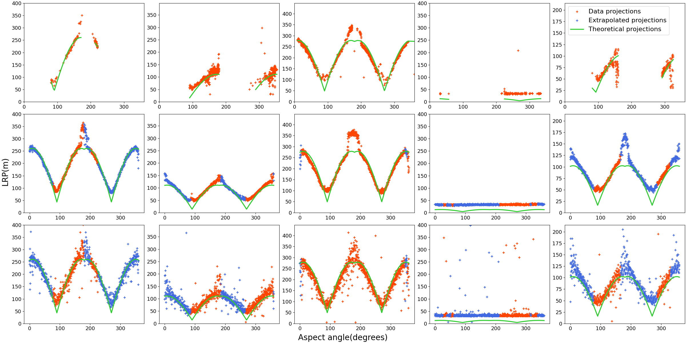

# HRRP Missing Scenarios

DDPM / GAN for High-Resolution-Range-Profile generation, in proceedings at ICASSP26.
Executable code lives in `src/ship_hrrp_gen`, configs in `configs/`.
<figure>
  
  <figcaption>Figure 1 — Instance of generated HRRP data from `data/ship_hrrp.pt` </figcaption>
</figure>

# Top contribution

Although HRRP data are inherently noisy and difficult to interpret, the theoretical target length observed in a radar HRRP follows a well-defined geometric relationship with the target’s aspect angle. This relationship is described by the _Line-Of-Sight Projection (LOSP)_ model:

LOSP(L, W, asp) = |L · cos(asp)| + |W · sin(asp)|

where _L_ and _W_ denote the target's true **length** and **width**, and _asp_ is target's **aspect angle** at acquisition time.

Using a robust detection of the target’s occupied range bins, the visual target's length called _Length on Range Profile_ (LRP) can be estimated directly from HRRP data. As shown in the accompanying figure, these measured lengths exhibit a clear correlation with the theoretical _LOSP_ curves, confirming that the physical projection geometry is preserved in real radar measurements.

The same analysis applied to **generated HRRP data** shows that the synthesized signals follow the same LOSP-consistent trends and successfully **fill missing aspect-angle scenarios**. This demonstrates that the generation process preserves the underlying physical and geometric constraints of radar line-of-sight projections, beyond simple signal-level realism.

<figure>
  
  <figcaption>Figure 2 — Correlation between visual <i>Length on Range Profile</i> (LRP) and <i>Line-Of-Sight Projection</i> (LOSP) for measured and generated data. </figcaption>
</figure>

## Quick requirements
- Python ≥ 3.9
- PyTorch (CPU or CUDA, matching your GPU if available)
- The generated demo set (`data/ship_hrrp.pt`).

## Installation
```bash
cd github_repo
python -m venv .venv
source .venv/bin/activate
pip install -r requirements.txt
pip install -e .   # installs the ship_hrrp_gen package from src/
```

## Run a training
```bash
python -m ship_hrrp_gen.train \
  --config configs/gan_scalars_serloss.yaml \
  --data data/ship_hrrp.pt \
  --seed 42 \
  --num-workers 0
```
Useful flags:
- `--num-workers`: dataloader workers (set 0 on small CPUs).
- `--skip-eval`: skip test metrics if no test split.
- `--fast-dev-run`: quick pipeline sanity-check (1 train/val/test batch).

## Quick sanity check
```bash
python -m ship_hrrp_gen.train \
  --config configs/gan_scalars_serloss.yaml \
  --data data/ship_hrrp.pt \
  --seed 0 \
  --num-workers 0 \
  --skip-eval \
  --fast-dev-run
```

Artifacts (checkpoints, figures, TensorBoard logs) are written under `results/` following the `figure_path` in the config.

## Layout
- `src/ship_hrrp_gen/`: models (DDPM, GAN), dataset, utils, training script (`train.py`).
- `configs/`: all YAML configs.
- `requirements.txt`: Python deps.
- `.gitignore`: ignores caches, venvs, and training outputs.

## Notes
- Intended for a quick demo run on the 128 generated samples; no multi-GPU setup required.
- Final metrics rely on `compute_metrics` in `ship_hrrp_gen.utils`. If there is no test split (`test_idx` empty), use `--skip-eval`.
