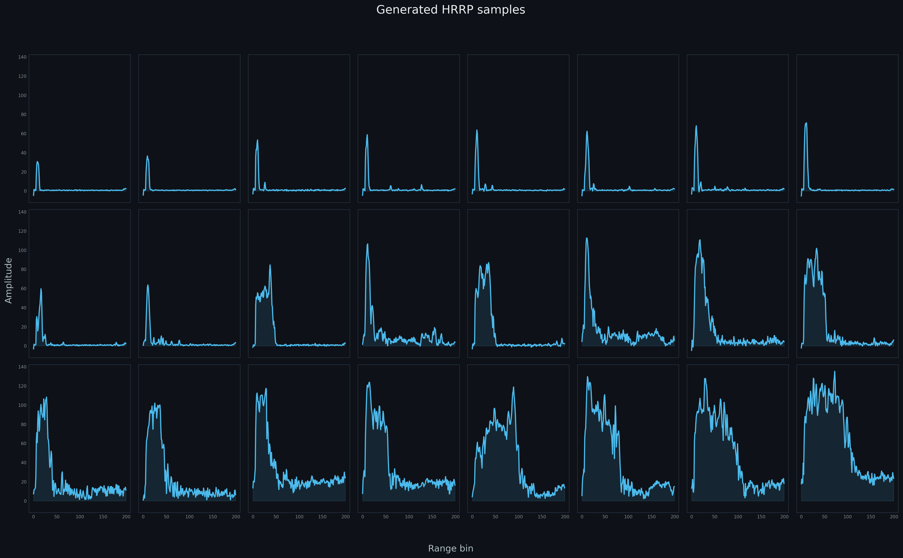
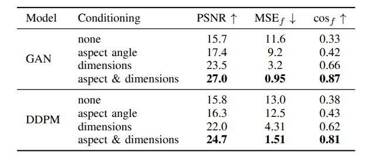
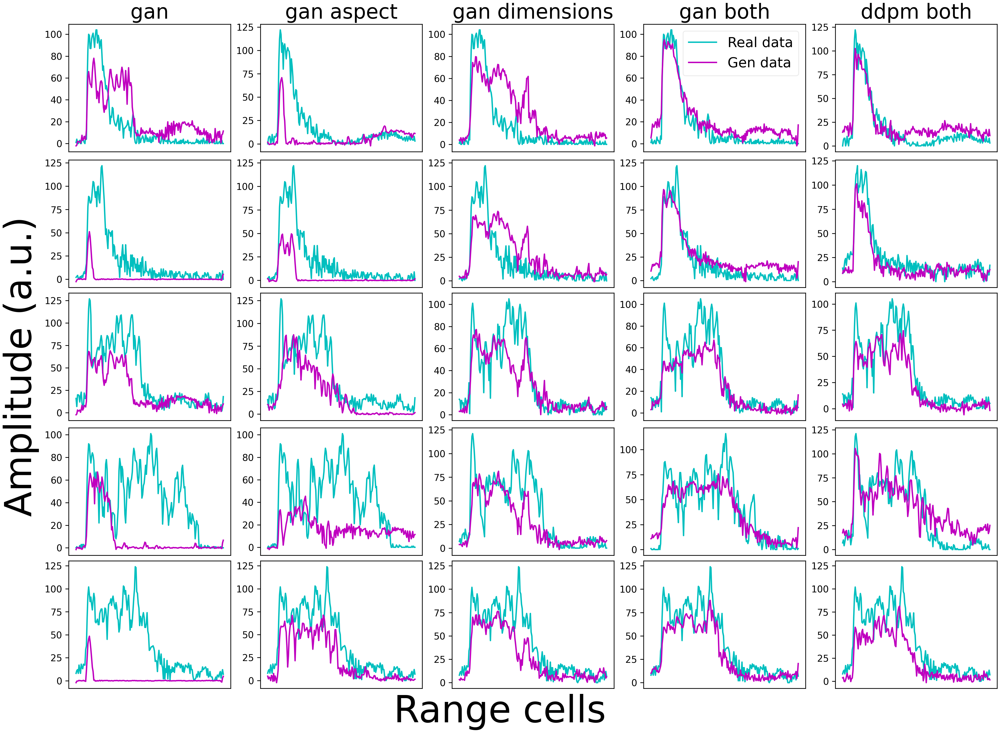
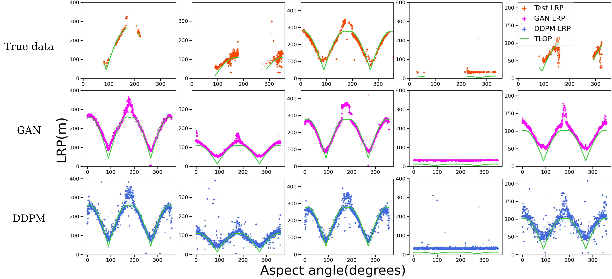

# Eusipco results

Experiments following the paper "Conditional Generative Models for High-Resolution Range Profiles: Capturing Geometry-Driven Trends in a Large-Scale Maritime Dataset", E. Brient, S. Velasco-Forero, R. Kassab submitted at Eusipco 2026 

Cleaned-up DDPM / GAN training code for HRRP radar profiles.  
Executable code lives in `src/ship_hrrp_gen`, configs in `configs/`.



## Quick catch up on the paper

This repo follows the paper *Conditional Generative Models for High-Resolution Range Profiles: Capturing Geometry-Driven Trends in a Large-Scale Maritime Dataset* (EUSIPCO 2026 submission).

### 1) Conditioning strategy (what is controlled)

The paper compares conditioning variants and shows that geometry-based conditioning is the key driver:

- **unconditional**: no metadata;
- **aspect-only** (`asp`): heading vs radar LOS;
- **dimensions-only** (`dims`): ship length/width;
- **aspect + dimensions** (`scals`): best overall compromise.

Main takeaway: adding **dimensions** strongly improves coarse structure realism; combining **aspect + dimensions** gives the best global behavior.

### 2) LOSP/LRP reminder (coarse geometry prior)

The theoretical projection length along line-of-sight is:

$$
\mathrm{LOSP}(L,W,asp)=|L\cos(asp)|+|W\sin(asp)|
$$

In practice, we estimate an empirical **LRP** (Length on Range Profile) from the HRRP envelope. The important point is the **trend agreement**: generated LRP should follow LOSP across aspect angle.

### 3) Results at a glance

#### Quantitative summary (paper-style table)



#### Generated HRRP examples



As in the paper, it is normal that nearest-match comparisons are not perfect at fine scale (HRRP is highly variable and noisy). The key objective here is to match **coarse-scale geometry-driven structure**.

#### LOSP/LRP trend on generated data



This figure is used to verify that generated profiles reproduce the expected LOSP/LRP geometric trend, including variability across ships and aspect angles.


## Quick requirements
- Python ≥ 3.9
- PyTorch (CPU or CUDA, matching your GPU if available)
- The generated demo set (`data/ship_hrrp.pt`).

## Installation
```bash
cd github_repo
python -m venv .venv
source .venv/bin/activate
pip install -r requirements.txt
pip install -e .   # installs the ship_hrrp_gen package from src/
```

## Run a training
```bash
python -m ship_hrrp_gen.train \
  --config configs/gan_scalars.yaml \
  --data data/ship_hrrp.pt \
  --seed 42 \
  --num-workers 0
```
Useful flags:
- `--num-workers`: dataloader workers (set 0 on small CPUs).
- `--skip-eval`: skip test metrics if no test split.
- `--fast-dev-run`: quick pipeline sanity-check (1 train/val/test batch).

## Quick sanity check
```bash
python -m ship_hrrp_gen.train \
  --config configs/gan_scalars.yaml \
  --data data/ship_hrrp.pt \
  --seed 0 \
  --num-workers 0 \
  --skip-eval \
  --fast-dev-run
```

Artifacts (checkpoints, figures, TensorBoard logs) are written under `results/` following the `figure_path` in the config.

## Layout
- `src/ship_hrrp_gen/`: models (DDPM, GAN), dataset, utils, training script (`train.py`).
- `configs/`: all YAML configs.
- `requirements.txt`: Python deps.
- `.gitignore`: ignores caches, venvs, and training outputs.

## Notes
- Intended for a quick demo run on the 128 generated samples; no multi-GPU setup required.
- Final metrics rely on `compute_metrics` in `ship_hrrp_gen.utils`. If there is no test split (`test_idx` empty), use `--skip-eval`.
